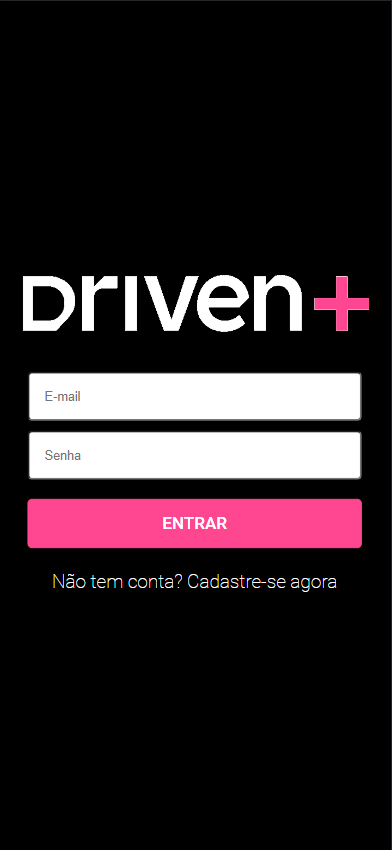
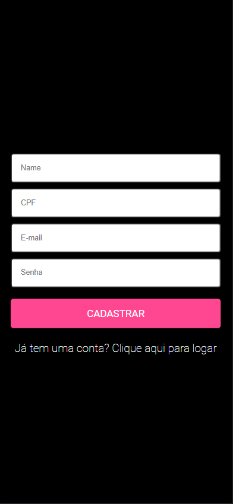
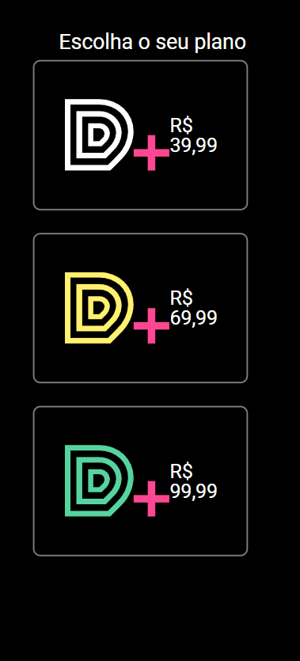
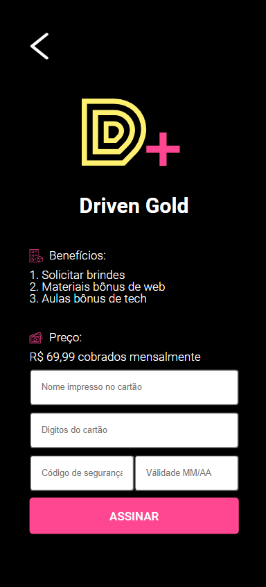
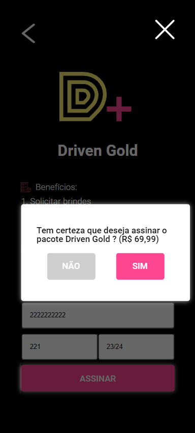
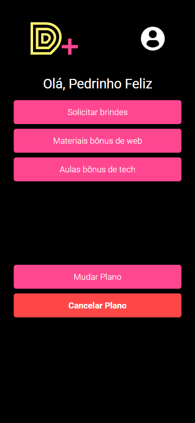

Sistema de Assinatura DrivenPlus.

## Tecnologias 
Algumas tecnologias usadas:

* ReactJS
* React Router dom, Styled Components, Axios...

## Serviços
* Github
* Vercel
  
## Como usar?
### 1 - Quando você acessa, essa é a Tela Inicial.

        
        
        <h4><strong>Obs:</strong> Tela de Login | Tela de Cadastro</h4>

 

### 2 - Logando na plataforma, ao iniciar será necessario escolher um plano.

 

### 3 - Adicione os dados de pagamento e confirme a escolha.

        
        
        <h4><strong>Obs:</strong> Tela de Login | Tela de Cadastro</h4>

 

### 4 - Obtenha acesso a informações exclusivas do seu pacote. ❤

## Recursos
  - Layout Mobile 📱
  - Criar uma conta na Plataforma ✨
  - Mudar Plano de Assinatura 📟
  - Cancelar o Plano ❌
  - Alterar dados do Usuário ♻️
  
## Links
  - Deploy Vercel: ***https://driven-plus-mu.vercel.app/***
  - Repositório: ***https://github.com/Pedro-Hen46/DrivenPlus***

  ## Autores

  * **Pedro Henrique dos Santos Silva** 
  
   
  
  Me siga no [**Github**](https://github.com/login?return_to=https%3A%2F%2Fgithub.com%2FPedro-Hen46) e Faça uma conexão no [**LinkedIn**](https://www.linkedin.com/in/pedro-henrique-dos-santos-silva-05012289) ❤

  Obrigado por visitar. 
